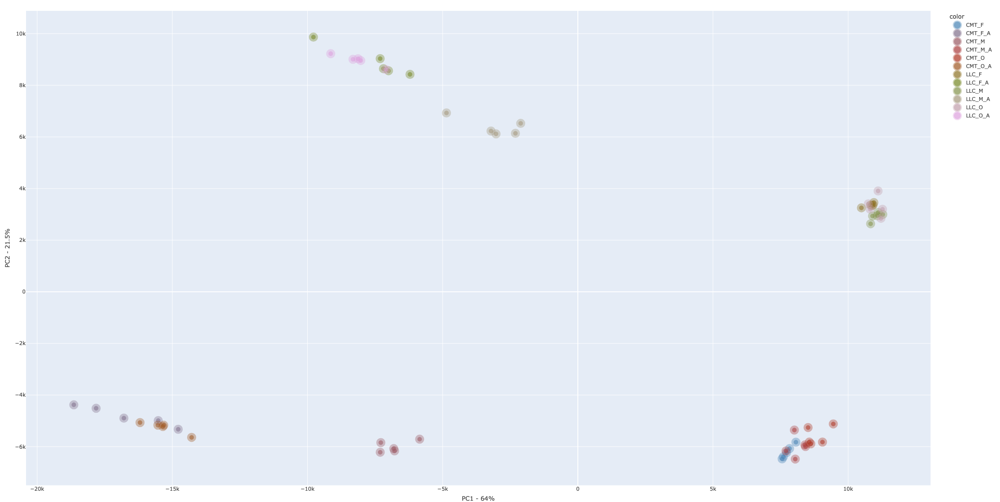
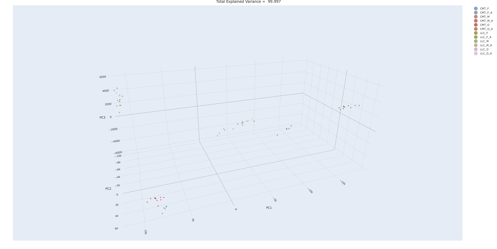

# Proteomics Core Analyses
Process proteomics data to generate standard first-pass deliverables.

## Differential Expression Analysis

### Introduction
This is a bioinformatics pipeline that performs differential gene expression analysis of proteomics intensity values. It is designed to provide a streamlined, reproducible workflow for identifying proteins with statistically significant abundance differences between experimental conditions. It incorporates best-practice recommendations for proteomics data analysis, including normalization, dispersion estimation, and hypothesis testing. A comprehensive report with key visualizations for each specified comparison is automatically generated.

### Table of Contents
- [Pipeline](#pipeline)
- [Preparing your R Environment](#preparing-your-r-environment)
- [Usage](#usage)
  - [Preparing Your Data](#preparing-your-data)
    - [1. Raw Merged Count Matrix](#raw-merged-count-matrix)
    - [2. Samplesheet](#samplesheet)
- [Running the Script](#running-the-script)
  - [Mouse Analysis](#mouse-analysis)
  - [Human Analysis](#human-analysis)
  - [Arguments](#arguments)
- [Pipeline Output](#pipeline-output)
  - [Data](#data)
    - [de_data](#de_data)
    - [Normalized Counts](#normalized-counts)
    - [gsea_data](#gsea_data)
  - [Figures](#figures)
    - [Volcano](#volcano)
    - [Heatmap](#heatmap)
    - [GSEA](#gsea)
    - [PCA](#pca)
- [Limitations](#limitations)
- [Utilizing IPA](#utilizing-ipa)
- [Manuscript-Ready Text](#manuscript-ready-text)
  - [Methods](#methods)
  - [References](#references)
  - [Required Acknowledgements](#required-acknowledgements)
- [Future Improvements](#future-improvements)
- [Contact](#contact)
- [License](#license)

### Pipeline


1. The input Samplesheet is parsed to generate contrasts definitions in the form of a comparisons list.
2. Runs differential analysis over all contrasts specified using [DESeq2 R package 1.44.0](https://doi.org/10.1186/s13059-014-0550-8).
3. Annotates genes in limma results dataframe. 
4. Optionally runs [Gene Set Enrichment Analysis (Gene Ontology)](https://www.gsea-msigdb.org/gsea/index.jsp).
5. Generates exploratory and differential analysis plots.
6. Automatically builds an HTML report based on R markdown, with plots and tables.

*Note:*
- This pipeline is intended for a "first pass" analysis. For custom or complex analyses, please contact our core and [submit a Jira ticket](https://www.masseycancercenter.org/research/shared-resource-cores/bioinformatics/)
- Differential abundance results are considered significant if the Benjamini-Hochberg adjusted p-value (padj) is less than or equal to 0.05 and the absolute log2 fold change is greater than 0.58 (corresponding to an absolute fold change of 1.5).

### Preparing your R Environment

`renv` is used to create an isolated environment. If this is your first time working with renv then please start an R session and run the following:

```R
install.packages("renv")
```

Then go ahead and close this repository and cd inside
```bash
git clone https://github.com/VCU-Bioinformatics-Core/proteomics_core_pipelines
cd proteomics_core_pipelines
```

From there, start another R session and run the following:
```R
library(renv)
renv::restore()
```

### Usage

#### Preparing Your Data
Two input files are required in specific formats: the **Raw Merged Count Matrix** and the **Samplesheet**.

##### 1. Raw Merged Count Matrix
**Required format:** Tab-Separated Values (`.tsv`)
This file contains the gene ids and raw merged gene expression counts. The columns must be organized as follows:
- **gene_id:** The first column must contain gene identifiers.
- **Subsequent Columns:** All subsequent columns should contain the raw count data for each sample. The `header` values for these sample columns must match the sample identifiers (`SampleID`) used in the samplesheet. The pipeline expects integer counts, as is typical for RNA-seq data. While the script has the functionality to automatically parse and handle count data from various quantification tools, the users are still responsible for removing any additional columns besides the gene IDs and sample counts. It currently works best with the merged counts output from pipelines like [`nf-core's rnaseq Nextflow pipeline`](https://nf-co.re/rnaseq).

| gene_id            | sample1_r1 | sample1_r2 | sample1_r3 | sample2_r1 | sample2_r2 | sample2_r3 | sample3_r1 | sample3_r2 | sample3_r3 | sample4_r1 | sample4_r2 | sample4_r3 |
| ------------------ | ---------- | ---------- | ---------- | ---------- | ---------- | ---------- | ---------- | ---------- | ---------- | ---------- | ---------- | ---------- |
| ENSMUSG00000000001 | 1234 | 2345 | 3456 | 4567 | 5678 | 6789 | 2345 | 3456 | 4567 | 5678 | 3456 | 4567 |
| ENSMUSG00000000002 | 1234 | 2345 | 3456 | 4567 | 5678 | 6789 | 2345 | 3456 | 4567 | 5678 | 3456 | 4567 |
| ENSMUSG00000000003 | 1234 | 2345 | 3456 | 4567 | 5678 | 6789 | 2345 | 3456 | 4567 | 5678 | 3456 | 4567 |
| ENSMUSG00000000004 | 1234 | 2345 | 3456 | 4567 | 5678 | 6789 | 2345 | 3456 | 4567 | 5678 | 3456 | 4567 |
| ENSMUSG00000000005 | 1234 | 2345 | 3456 | 4567 | 5678 | 6789 | 2345 | 3456 | 4567 | 5678 | 3456 | 4567 |
  
##### 2. Samplesheet:
**Required format:** Comma-Separated Values (`.csv`)
This file contains metadata for each sample, including group identifiers and binary indicators for specific comparisons. The columns must be organized as follows:
- **SampleID:** Sample identifiers that exactly match the sample column headers in the count matrix.
- **GroupID:** Group identifiers for each sample (e.g., `experiment1`, `control1`). These group identifiers are crucial for defining the experimental design in DESeq2.
- [comparison]: Subsequent columns define pairwise comparisons. The column name should follow the format `experiment_vs_control`. For each comparison column, use `1` to indicate samples belonging to the experimental group, `0` for the control group, and leave the cell `blank` for samples to be excluded from that specific comparison. This design matrix setup allows the user to specify which samples are used for each comparison, providing flexibility in complex experimental designs.

| SampleID | GroupID      | experiment1_vs_control1	| experiment2_vs_control2	|
| -------- | ------------ | ------------------------- | ------------------------- |
| sample1_r1  | experiment1    | 1                  |              							|
| sample1_r2  | experiment1    | 1                  |							              |
| sample1_r3  | experiment1    | 1                  |							              |
| sample2_r1  | control1  | 0                 |                        	|
| sample2_r2  | control1  | 0                 |                        	|
| sample2_r3  | control1  | 0                 |                        	|
| sample3_r1  | experiment2 |                		    | 1                      	|
| sample3_r2  | experiment2 |                		    | 1                      	|
| sample3_r3  | experiment2 |                		    | 1                      	|
| sample4_r1  | control2 |                		| 0                      	|
| sample4_r2  | control2 |                		| 0                      	|
| sample4_r3  | control2 |                		| 0                      	|


#### Running the Script

The pipeline is executed using an R script. Example commands for running it on VCU HPRC (high performance research computing servers) are as follows:

##### Mouse Analysis

```bash
module load R/4.4.1

Rscript de.R \
--counts mouse_counts.tsv \
--samplesheet samplesheet.csv \
--outdir mouse_results \
--runid mouse_experiment \
--annotation mouse
```
  
##### Human Analysis

```bash
module load R/4.4.1

Rscript de.R \
--counts human_counts.tsv \
--samplesheet samplesheet.csv \
--outdir human_results \
--runid human_experiment \
--annotation human
```

##### Arguments
- `-c, --counts`: Path to the merged counts file **(Mandatory)**
- `-s, --samplesheet`: Path to the sample sheet file **(Mandatory)**
- `-o, --outdir`: Output directory (default: ./output)
- `-r, --runid`: Unique identifier for the analysis run **(Mandatory)**
- `-a, --annotation`: Genome to use for annotation: 'mouse' or 'human' (default: mouse)  

### Pipeline Output
The pipeline generates an output directory (specified by `--outdir`) containing two main subdirectories: `data` and `figures`.
- **data**: Analysis results
  - **de_data**: contains TMM normalized counts data stored within `normalizedCounts_TMM[date].csv` and DESeq2 results for each comparision in `DESeq2_[comparison].csv`
  - **gsea_data**: contains GSE-GO analysis results for each comparison in `GO_Analysis_[comparison].csv`
- **figures**: contains subdirectories for different visualizations generated for each comparison
  - **volcano**: for each comparison, contains a volcano plot named `[comparison]volcano.png`
  - **heatmap**: for each comparison, contains a heatmap named `[comparison]heatmap.png`
  - **gsea**: for each comparison, contains the gsea results named `[comparison]GSEA.png`
  - **pca**: pca representations of the data, including an interactive PCA and a 3D PCA plot.

```
[outDir]/
├── data/
│   ├── de_data/
│   │   └── DESeq2_[comparison].csv
│   ├── normalizedCounts_TMM[date].csv
│   └── gsea_data/
│       └── GO_Analysis_[comparison].csv
|   
└── figures/
    ├── volcano/
    │   └── [comparison]volcano.png
    ├── heatmap/
    │   └── [comparison]heatmap.png
    ├── gsea/
    │   └── [comparison]GSEA.png
    └── pca/
        ├── PCA_plot.png
        ├── allsamples_PCA_plot.html
        └── allsamples_PCA_plot3D.html
```

#### Data
This directory contains analysis output organized into subdirectories for DE and GSE-GO Analysis results.

##### de_data
DESeq_[comparison].csv: Contains the differential expression results from DESeq2 for each specified comparison. The columns include:

| Gene ID      | baseMean  | log2FoldChange | lfcSE   | stat      | pvalue   | padj     |
|--------------|-----------|----------------|---------|-----------|----------|----------|
| ENSG001  | 95.28865  | 0.00399148     | 0.225010| 0.0177391 | 0.9858470| 0.996699 |
| ENSG002  | 4359.09632| -0.23842494    | 0.127094| -1.8759764| 0.0606585| 0.289604 |
| ENSG003  | 419.06811 | -0.10185506    | 0.146568| -0.6949338| 0.4870968| 0.822681 |
| ...      | ...       | ...            | ...     | ...       | ...      | ...      | 
| ENSG00N  | 4863.807  | 0.0179729      | 0.194137| 0.0925784 | 0.9262385| 0.986726 |

Where:
- `gene_id`:  The unique gene identifier.
- `baseMean`: The average normalized expression count for the gene across all samples.
- `log2FoldChange`: The log2 of the fold change in expression between the two groups being compared.  A positive value indicates higher expression in the experimental group, while a negative value indicates higher expression in the control group.
- `lfcSE`: The standard error of the log2 fold change estimate.
- `stat`: The Wald statistic used for testing the null hypothesis of no differential expression.
- `pvalue`: The raw p-value associated with the Wald statistic.
- `padj`: The Benjamini-Hochberg adjusted p-value, which corrects for multiple testing.

##### Normalized Counts:
Contains the read counts normalized using the Trimmed Mean of M-values (TMM) method. TMM normalization is performed using the edgeR package (Robinson et al., 2010) to account for differences in library size and RNA composition between samples. The date is appended to the filename for version control. These counts are used to produce the heatmap visualizations for each comparison.

| gene_id            | sample1_r1 | sample1_r2 | sample1_r3 | sample2_r1 | sample2_r2 | sample2_r3 | sample3_r1 | sample3_r2 | sample3_r3 | sample4_r1 | sample4_r2 | sample4_r3 |
| ------------------ | ---------- | ---------- | ---------- | ---------- | ---------- | ---------- | ---------- | ---------- | ---------- | ---------- | ---------- | ---------- |
| ENSMUSG00000000001 | 233.57 | 235.04 | 235.99 | 234.16 | 234.168 | 235.62 | 185.51 | 187.64 | 4567 | 5678 | 3456 | 4567 |
| ENSMUSG00000000002 | 0 | 0.13 | 0.19 | 0 | 0.15 | 0.17 | 0 | 0. | 0.10 | 0.13 | 0 | 0.05 |
| ENSMUSG00000000003 | 1.23 | 2.34 | 3.45 | 4.56 | 5.67 | 6.78 | 2.34 | 3.45 | 4.56 | 5.67 | 3.45 | 4.56 |
| ...                | ... | ... | ... | ... | ... | ... | ... | ... | ... | ... | ... | ... |
| ENSMUSG0000000000N | 1.23 | 2.34 | 3.45 | 4.56 | 5.67 | 6.78 | 2.34 | 3.45 | 4.56 | 5.67 | 3.45 | 4.56 |
  

##### gsea_data
**GO_Analysis_[comparison].csv:** Contains the results of the Gene Set Enrichment Analysis (GSEA) using Gene Ontology (GO) terms for each comparison. GSEA is performed using a suitable R package (e.g., clusterProfiler) to identify enriched GO terms among the differentially expressed genes. This analysis is skipped for a comparison if the Gene Set identified doesnot have enough genes. 

|       | ONTOLOGY | ID | Description | setSize | enrichmentScore | NES | pvalue | p.adjust | qvalue | rank | leading_edge | core_enrichment |
| ----- | ---- | ----- | ---- | ----- | ---- | ----- | ---- | ----- | ---- | ----- | ---- | ----- |
| GO:0044391 | CC | GO:0044391 | ribosomal subunit | 195 | 0.541189822117829 | 2.28184891440785 | 1e-10 | 8.3476e-08 | 7.66105263157895e-08 | 5236 | tags=68%, list=32%, signal=47% | Rpl36a-ps1/Mrpl4/Mrpl35/Rps27a | 
| ... | ... | ... | ... | ... | ... | ... | ... | ... | ... | ... | ... | ... |
| GO:0003735 | BP | GO:0003735 | positive regulation of cytokine production | 357 | ... | ... | ... | ... | ... | ... | ... | ... |

#### Figures
This directory contains various visualizations generated for each comparison.

##### Volcano
**[comparison]volcano.png:** A volcano plot displaying the log2 fold change against the negative logarithm (base 10) of the adjusted p-value for each gene in the differential expression results. This plot allows for a quick visual assessment of both the magnitude of differential expression and its statistical significance. Genes with large log2 fold changes and low adjusted p-values (i.e., in the upper corners of the plot) are considered as the most interesting candidates.


##### Heatmap
**[comparison]heatmap.png:** A heatmap visualizing the expression patterns of the top differentially expressed genes (based on adjusted p-value) across samples. The expression values are typically represented as Z-scores, which normalize the expression of each gene across samples to have a mean of 0 and a standard deviation of 1. This helps to visualize relative expression differences for each gene. The heatmap provides a visual overview of how gene expression varies across different experimental conditions. Heatmaps use the Normalized TMM count data.


##### GSEA
**[comparison]GSEA.png:** A dot plot summarizing the Gene Set Enrichment Analysis (GSEA) results, showing enriched GO terms and their significance. The size and color of the dots represent the normalized enrichment score and adjusted p-value, respectively.


##### PCA
**PCA Plots:** Principal Component Analysis (PCA) plots showing the relationships between samples based on their gene expression profiles. PCA is used to reduce the dimensionality of the data and visualize the primary sources of variation in gene expression. The pipeline generates:

- A static 2D plot


- Interactive PCA Plot

*(Click the link above to open the interactive plot in a new tab.)*

- Interactive 3D representation of the plot:

*(Click the link above to open the interactive plot in a new tab.)*

  - If you'd like to see a static preview, check out the images below:
  
  

These plots help to assess the overall quality of the data, identify potential outliers, and visualize the separation of samples according to experimental conditions.

### Limitations
- This pipeline currently supports only pairwise comparisons. Support for more complex designs with multiple comparisons with covariates and contrast matrices will be added in future versions. This is a limitation for experiments with more than two conditions.
- The pipeline works best with merged count matrices generated from pipelines like [`nf-core's rnaseq Nextflow pipeline`](https://nf-co.re/rnaseq). While the script is being developed to handle count data from any source, users may need to pre-format their count matrices accordingly. Specifically, the matrix should have a `gene_id` column, with subsequent columns containing raw counts for each sample.


### Utilizing IPA

The CSV Differential Expression output from DESeq2 (available in the results directory
provided alongside this report *./output/de_data/DESeq2_[comparison_name].csv*), can be
uploaded directly into **QIAGEN Ingenuity Pathway Analysis (IPA)** for self-exploration of
pathways predicted to be enriched by this experimental condition. Massey’s BISR provides
access to VCU’s license of IPA. If you do not already have an account associated with this
license, you may reach out to **morecockcm@vcu.edu** with your name, VCU health or VCU
email, and request for IPA. To perform a core expression analysis, login with your
credentials here: **https://analysis.ingenuity.com/pa** and follow the instructions [here](https://qiagen.my.salesforce-sites.com/KnowledgeBase/KnowledgeNavigatorPage?id=kA41i000000L6rMCAS).

We host an annual hands-on training for IPA at the beginning of the fall semester. Please
email BISR if you would like to be a part of this training. In the meantime, QIAGEN has a
playlist of user-friendly tutorials available on Youtube titled “QIAGEN IPA Training
Videos” the **Qiagen Digital Insights Youtube** page.

### Manuscript-Ready Text

#### Methods
Raw RNA-Seq fastq files were processed by the VCU Massey Comprehensive Cancer Center Bioinformatics Shared Resource (BISR) using the NextFlow nf-core/rnaseq v3.18.0 pipeline [1]. Briefly, this pipeline assesses sequencing quality using FastQC v 0.12.1 [2] before and after trimming, performs adaptor trimming with Trim Galore! v0.6.10 [3], and aligns sequencing reads to the GRCh38 human primary assembly reference genome using STAR v 2.7.11b [4] with transcriptome quantification by Salmon v1.10.3 [5].  Pipeline output includes gene expression raw count data and a comprehensive QC report compiled by MultiQC v1.25.1 [6].
Differential expression analysis was performed using DESeq2 v 1.44.0 [7]. Lowly expressed genes were filtered out per DESeq2 methods [7] prior to normalization and differential expression testing. Significance was calculated using the Wald-test and adjusted using Benjamini Hochberg False Discovery Rate (FDR). Volcano plots and heatmaps were generated using the EdgeR TMM normalized count data and visualized using R packages. Significant differentially expressed genes (DEGs) are defined as those with an FDR<0.05 and absolute fold-change of 1.5 (log2 fold-change = 0.58) or greater. Gene Set Enrichment Analysis (GSEA) [8] for Gene Ontology terms (GO) was performed using the clusterProfiler package [9] across all genes, regardless of significance. All computational analyses were performed on VCU’s High Performance Research Computing cluster.

#### References
1) Ewels P, Peltzer A, Fillinger S, Patel H, Alneberg J, Wilm A, Garcia MU, Di Tommaso P, Nahnsen S. The nf-core framework for community-curated bioinformatics pipelines. Nat Biotechnol. 2020 Feb 13. doi:10.1038/s41587-020-0439-x
Andrews S. FastQC: A Quality Control Tool for High Throughput Sequence Data. Babraham Bioinformatics; 2010. Accessed June 18, 2025. https://www.bioinformatics.babraham.ac.uk/projects/fastqc/.

2) Krueger F. Trim Galore! v0.6.10. 2023. Available at: https://github.com/FelixKrueger/TrimGalore. Accessed June 18, 2025.

3) Dobin A, Davis CA, Schlesinger F, Drenkow J, Zaleski C, Jha S, Batut P, Chaisson M, Gingeras TR. STAR: ultrafast universal RNA-seq aligner. Bioinformatics. 2013 Jan 1;29(1):15-21. doi: 10.1093/bioinformatics/bts635

4) Patro, R., Duggal, G., Love, M.I., Irizarry, R.A., Kingsford, C., 2017. Salmon provides fast and bias-aware quantification of transcript expression. Nat. Methods 14, 417–419. https://doi.org/10.1038/nmeth.4197

5) Ewels, P., Magnusson, M., Lundin, S., Käller, M., 2016. MultiQC: summarize analysis results for multiple tools and samples in a single report. Bioinformatics 32, 3047–3048. https://doi.org/10.1093/bioinformatics/btw354

6) Love, M.I., Huber, W., Anders, S., 2014. Moderated estimation of fold change and dispersion for RNA-seq data with DESeq2. Genome Biology 15, 550. https://doi.org/10.1186/s13059-014-0550-8

7) A. Subramanian, P. Tamayo, V.K. Mootha, S. Mukherjee, B.L. Ebert, M.A. Gillette, A. Paulovich, S.L. Pomeroy, T.R. Golub, E.S. Lander, & J.P. Mesirov, Gene set enrichment analysis: A knowledge-based approach for interpreting genome-wide expression profiles, Proc. Natl. Acad. Sci. U.S.A. 102 (43) 15545-15550, https://doi.org/10.1073/pnas.0506580102 (2005).

8) Yu G, Wang LG, Han Y, He QY. clusterProfiler: an R package for comparing biological themes among gene clusters. OMICS. 2012 May;16(5):284-7. doi: 10.1089/omi.2011.0118. Epub 2012 Mar 28. PMID: 22455463; PMCID: PMC3339379.

#### Required Acknowledgements

Please include the following statements in your acknowledgements manuscript section:

- “Services in support of the research project were provided by the VCU Massey Comprehensive Cancer Center Bioinformatics Shared Resource. Massey is supported, in part, with funding from NIH-NCI Cancer Center Support Grant P30 CA016059.”

- “High Performance Computing resources provided by the High Performance Research Computing (HPRC) core facility at Virginia Commonwealth University (https://hprc.vcu.edu) were used for conducting the research reported in this work.”

### Future Improvements
- Add support for the EdgeR package for differential expression analysis.
- Implement functionality to perform analyses using multi-factor designs and covariates.
- Incorporate a KEGG pathway analysis module.
- Add support for gene annotation using Entrez IDS.
  
### Contact
For questions or issues, please contact the BISR group at [mccbioinfo@vcu.edu] or open a GitHub issue in the repository.

### License
[GPL-3.0 license](https://github.com/VCU-Bioinformatics-Core/proteomics_core_pipelines/tree/main?tab=GPL-3.0-1-ov-file#)
